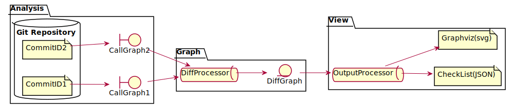
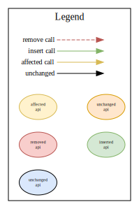
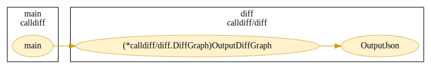
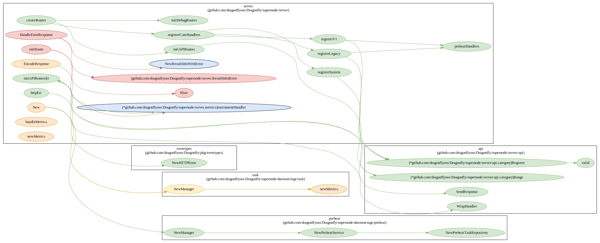

# Calldiff

## 背景

复杂项目的日常迭代中，研发同学想了解某个改动的影响点，往往需要深入代码细节才能获得尽可能全的 checklist 。然而，由于项目的复杂性，我们获得的 checklist 又难免会有一些遗漏。

为了减轻研发同学的心智负担，辅助同学们更有效地保证服务稳定性，本项目应运而生。

本项目，旨在更加智能地帮助研发同学理清代码改动的影响点，明确上线 checklist ，提升研发同学的幸福感。


## 设计目标
> Git 工具仅提供文本层级改动的追踪，缺少对代码层级的改动的追踪，在研发过程中开发人员需要追踪某一代码改动对其它代码的影响。
* 设计一个 Golang 程序静态分析工具，当代码发生变更时，提供函数调用链变更的追踪功能
* 具体地，我们针对不同的 Commit ID ，建立函数调用关系图；对两幅图进行比较及分析，最终输出差异结果（包括 JSON 及 SVG ）。

## 模块分层

<div style="text-align:center"></div>

## 编译

```bash
make build
```

## 运行

```bash
./calldiff \
    --url=https://github.com/*.git \
    --dir=/path/to/repo \
    --old=<Commit ID> \
    --new=<Commit ID> \
    --test=true \
    --private=true \
    --unchanged=true \
    --pkg=main
```

## 参数

| 参数    | 含义                                                            | 默认值 |
| --------- | ----------------------------------------------------------------- | ------ |
| url       | Git 远程仓库地址（当本地无目标项目时进行 git clone） | null   |
| dir       | Git 本地仓库地址（当本地无目标项目时，含义为 git clone 本地路径） | .      |
| old       | 用以对比的两个 Commit ID 中，较早的一个             | HEAD^  |
| new       | 用以对比的两个 Commit ID 中，较新的一个             | HEAD   |
| test      | 静态分析时，是否考虑单元测试相关文件            | false  |
| private   | 输出差异时，是否输出未导出的函数                  | false  |
| unchanged | 输出差异时，是否输出未发生变化的函数            | false  |
| pkg       | 输出差异时，输出指定包的差异情况                  | main   |

## 图例

<div style="text-align:center"></div>

## 样例

### Calldiff 项目

```bash
make run
```

该命令输出当前目录下，HEAD^ 和 HEAD 两个 Commit 的函数调用关系图之间差异。

```json
{
    "pkg": "main",
    "change_list": {
        "modified": [
            {
                "name": "main.main",
                "added_call": null,
                "deleted_call": null,
                "affected_call": [
                    {
                        "name": "diff.(*calldiff/diff.DiffGraph)OutputDiffGraph",
                        "affected_by": [
                            "diff.getModificationDetail"
                        ]
                    }
                ],
                "ast_changed": false
            }
        ],
        "new": null,
        "deleted": null,
        "unchanged": null
    }
}
```

<div style="text-align:center"></div>

### Dragonfly 项目

```bash
./calldiff \
    --url=https://github.com/dragonflyoss/Dragonfly.git \
    --dir=./Dragonfly \ --old=7856ccdbb1e91bf2fefdc32e030780224f68e4be \
    --pkg=algorithm \
    --test=true
```

该命令首先会从 github 上 clone 目标项目至 `dir` 下，并比较 `7856ccdbb1e91bf2fefdc32e030780224f68e4be` 和 HEAD  两个 Commit 的函数调用关系图之间差异。

```json
{
    "pkg": "server",
    "change_list": {
        "modified": [
            {
                "name": "server.EncodeResponse",
                "added_call": [
                    "api.SendResponse"
                ],
                "deleted_call": null,
                "affected_call": null,
                "ast_changed": true
            },
            {
                "name": "server.handleMetrics",
                "added_call": null,
                "deleted_call": null,
                "affected_call": null,
                "ast_changed": true
            },
            {
                "name": "server.newMetrics",
                "added_call": null,
                "deleted_call": null,
                "affected_call": null,
                "ast_changed": true
            },
            {
                "name": "server.New",
                "added_call": [
                    "preheat.NewManager"
                ],
                "deleted_call": null,
                "affected_call": [
                    {
                        "name": "task.NewManager",
                        "affected_by": [
                            "task.newMetrics"
                        ]
                    }
                ],
                "ast_changed": true
            }
        ],
        "new": [
            "server.createRouter",
            "server.registerCoreHandlers",
            "server.initAPIRoutes$1",
            "server.initDebugRoutes",
            "server.initAPIRoutes",
            "server.registerSystem",
            "server.preheatHandlers",
            "server.httpErr",
            "server.registerLegacy",
            "server.registerV1"
        ],
        "deleted": [
            "server.(github.com/dragonflyoss/Dragonfly/supernode/server.ResultInfo)Error",
            "server.initRoute",
            "server.filter",
            "server.HandleErrorResponse"
        ],
        "unchanged": null
    }
}
```

<div style="text-align:center"></div>